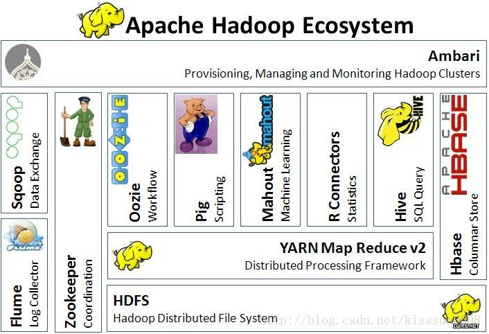

#                                    hadoop介绍文章

如今Apache Hadoop已成为大数据行业发展背后的驱动力。Hive和Pig等技术也经常被提到，但是他们都有什么功能，为什么会需要奇怪的名字（如Oozie，ZooKeeper、Flume）。

Hadoop带来了廉价的处理大数据（大数据的数据容量通常是10-100GB或更多，同时数据种类多种多样，包括结构化、非结构化等）的能力。但这与之前有什么不同？

现今企业数据仓库和关系型数据库擅长处理结构化数据，并且可以存储大量的数据。但成本上有些昂贵。这种对数据的要求限制了可处理的数据种类，同时这种惯性所带的缺点还影响到数据仓库在面对海量异构数据时对于敏捷的探索。这通常意味着有价值的数据源在组织内从未被挖掘。这就是Hadoop与传统数据处理方式最大的不同。

本文就重点探讨了Hadoop系统的组成部分，并解释各个组成部分的功能。

**MapReduce——Hadoop的核心**

Google的网络搜索引擎在得益于算法发挥作用的同时，MapReduce在后台发挥了极大的作用。MapReduce框架成为当今大数据处理背后的最具影响力的“发动机”。除了Hadoop，你还会在MapReduce上发现MPP（Sybase IQ推出了列示数据库）和NoSQL（如Vertica和MongoDB）。

MapReduce的重要创新是当处理一个大数据集查询时会将其任务分解并在运行的多个节点中处理。当数据量很大时就无法在一台服务器上解决问题，此时分布式计算优势就体现出来。将这种技术与Linux服务器结合可获得性价比极高的替代大规模计算阵列的方法。Yahoo在2006年看到了Hadoop未来的潜力，并邀请Hadoop创始人Doug Cutting着手发展Hadoop技术，在2008年Hadoop已经形成一定的规模。Hadoop项目再从初期发展的成熟的过程中同时吸纳了一些其他的组件，以便进一步提高自身的易用性和功能。

**HDFS和MapReduce**

以上我们讨论了MapReduce将任务分发到多个服务器上处理大数据的能力。而对于分布式计算，每个服务器必须具备对数据的访问能力，这就是HDFS（Hadoop Distributed File System）所起到的作用。

HDFS与MapReduce的结合是强大的。在处理大数据的过程中，当Hadoop集群中的服务器出现错误时，整个计算过程并不会终止。同时HFDS可保障在整个集群中发生故障错误时的数据冗余。当计算完成时将结果写入HFDS的一个节点之中。HDFS对存储的数据格式并无苛刻的要求，数据可以是非结构化或其它类别。相反关系数据库在存储数据之前需要将数据结构化并定义架构。

开发人员编写代码责任是使数据有意义。Hadoop MapReduce级的编程利用Java APIs，并可手动加载数据文件到HDFS之中。

**Pig和Hive**

对于开发人员，直接使用Java APIs可能是乏味或容易出错的，同时也限制了Java程序员在Hadoop上编程的运用灵活性。于是Hadoop提供了两个解决方案，使得Hadoop编程变得更加容易。

•Pig是一种编程语言，它简化了Hadoop常见的工作任务。Pig可加载数据、表达转换数据以及存储最终结果。Pig内置的操作使得半结构化数据变得有意义（如日志文件）。同时Pig可扩展使用Java中添加的自定义数据类型并支持数据转换。

•Hive在Hadoop中扮演数据仓库的角色。Hive添加数据的结构在HDFS（hive superimposes structure on data in HDFS），并允许使用类似于SQL语法进行数据查询。与Pig一样，Hive的核心功能是可扩展的。

Pig和Hive总是令人困惑的。Hive更适合于数据仓库的任务，Hive主要用于静态的结构以及需要经常分析的工作。Hive与SQL相似促使其成为Hadoop与其他BI工具结合的理想交集。Pig赋予开发人员在大数据集领域更多的灵活性，并允许开发简洁的脚本用于转换数据流以便嵌入到较大的应用程序。Pig相比Hive相对轻量，它主要的优势是相比于直接使用Hadoop Java APIs可大幅削减代码量。正因为如此，Pig仍然是吸引大量的软件开发人员。

**改善数据访问：HBase、Sqoop以及Flume**

Hadoop核心还是一套批处理系统，数据加载进HDFS、处理然后检索。对于计算这或多或少有些倒退，但通常互动和随机存取数据是有必要的。HBase作为面向列的数据库运行在HDFS之上。HBase以Google BigTable为蓝本。项目的目标就是快速在主机内数十亿行数据中定位所需的数据并访问它。HBase利用MapReduce来处理内部的海量数据。同时Hive和Pig都可以与HBase组合使用，Hive和Pig还为HBase提供了高层语言支持，使得在HBase上进行数据统计处理变的非常简单。

但为了授权随机存储数据，HBase也做出了一些限制：例如Hive与HBase的性能比原生在HDFS之上的Hive要慢4-5倍。同时HBase大约可存储PB级的数据，与之相比HDFS的容量限制达到30PB。HBase不适合用于ad-hoc分析，HBase更适合整合大数据作为大型应用的一部分，包括日志、计算以及时间序列数据。

**获取数据与输出数据**

Sqoop和Flume可改进数据的互操作性和其余部分。Sqoop功能主要是从关系数据库导入数据到Hadoop，并可直接导入到HFDS或Hive。而Flume设计旨在直接将流数据或日志数据导入HDFS。

Hive具备的友好SQL查询是与繁多数据库的理想结合点，数据库工具通过JDBC或ODBC数据库驱动程序连接。

**负责协调工作流程的ZooKeeper和Oozie**

随着越来越多的项目加入Hadoop大家庭并成为集群系统运作的一部分，大数据处理系统需要负责协调工作的的成员。随着计算节点的增多，集群成员需要彼此同步并了解去哪里访问服务和如何配置，ZooKeeper正是为此而生的。

而在Hadoop执行的任务有时候需要将多个Map/Reduce作业连接到一起，它们之间或许批次依赖。Oozie组件提供管理工作流程和依赖的功能，并无需开发人员编写定制的解决方案。

Ambari是最新加入Hadoop的项目，Ambari项目旨在将监控和管理等核心功能加入Hadoop项目。Ambari可帮助系统管理员部署和配置Hadoop，升级集群以及监控服务。还可通过API集成与其他的系统管理工具。

Apache Whirr是一套运行于云服务的类库（包括Hadoop），可提供高度的互补性。Whirr现今相对中立，当前支持Amazon EC2和Rackspace服务。

**机器学习：Mahout** 

各类组织需求的不同导致相关的数据形形色色，对这些数据的分析也需要多样化的方法。Mahout提供一些可扩展的机器学习领域经典算法的实现，旨在帮助开发人员更加方便快捷地创建智能应用程序。Mahout包含许多实现，包括集群、分类、推荐过滤、频繁子项挖掘。

**使用Hadoop**

通常情况下，Hadoop应用于分布式环境。就像之前Linux的状况一样，厂商集成和测试Apache Hadoop生态系统的组件，并添加自己的工具和管理功能

### 1、数据仓库

#### 1、Pig

一种编程语言，它简化了Hadoop常见的工作任务。Pig可加载数据、表达转换数据以及存储最终结果。Pig内置的操作使得半结构化数据变得有意义（如日志文件）。同时Pig可扩展使用Java中添加的自定义数据类型并支持数据转换

#### 2、Hive

在Hadoop中扮演数据仓库的角色。Hive添加数据的结构在HDFS（hive superimposes structure on data in HDFS），并允许使用类似于SQL语法进行数据查询。与Pig一样，Hive的核心功能是可扩展的。Pig和Hive总是令人困惑的。Hive更适合于数据仓库的任务，Hive主要用于静态的结构以及需要经常分析的工作

**Pig相比Hive相对轻量，它主要的优势是相比于直接使用Hadoop Java APIs可大幅削减代码量**

### 2、获取数据与输出数据
1. **Sqoop**
   可改进数据的互操作性和其余部分，主要是从关系数据库导入数据到Hadoop，并可直接导入到HFDS或Hive
2. **Flume**
   可改进数据的互操作性和其余部分，Flume设计旨在直接将流数据或日志数据导入HDFS

### 3、协调工作流程

1. **Zookeeper**

   大数据处理系统需要负责协调工作的的成员。随着计算节点的增多，集群成员需要彼此同步并了解去哪里访问服务和如何配置，ZooKeeper正是为此而生的

2. **Oozle**

   提供管理工作流程和依赖的功能，并无需开发人员编写定制的解决方案

### 4、机器学习

1. **mahout**

   ​

### 5、Hadoop生态圈

这是以体系从下到上的布局展示的Hadoop生态系统图，言明了各工具软件在体系中所处的位置

 